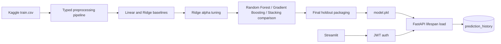

# House Price Prediction - Backend and ML Integration

This project implements the internship training roadmap with a FastAPI backend,
SQLite/SQLAlchemy persistence, JWT authentication, a Streamlit client, and a
Kaggle House Prices regression pipeline. The app supports local development,
manual retraining, and Render deployment with build-time model packaging.

## Architecture

```text
Streamlit UI
  -> FastAPI auth and prediction routes
      -> JWT dependency
      -> SQLAlchemy sessions
      -> SQLite users and prediction_history tables
      -> sklearn pipeline loaded once during FastAPI lifespan
```



Important runtime paths:

- `my-project/src/api/`: FastAPI app, auth routes, prediction routes, request logging.
- `my-project/src/ml/`: preprocessing, training, evaluation, final model packaging.
- `my-project/src/models/`: SQLAlchemy entities with shared audit fields.
- `my-project/src/schemas/`: Pydantic request/response contracts.
- `my-project/src/streamlit_app/`: login, prediction, history, and demo UI.
- `my-project/alembic/`: database migration history.

Generated CSV files, SQLite databases, experiment artifacts, `.env`, and
`my-project/model.pkl` are intentionally not committed.

## Local Setup

From the repository root in PowerShell:

```powershell
python -m venv .venv
.\.venv\Scripts\Activate.ps1
python -m pip install --upgrade pip
pip install -r requirements.txt
pip install -e .
Copy-Item .env.example .env
alembic -c my-project/alembic.ini upgrade head
```

Replace `SECRET_KEY` in `.env` before using the app outside local practice.

## Data and Training

Download the Kaggle House Prices competition data into `my-project/data/raw`:

```powershell
python my-project/src/scripts/download_house_prices.py --destination my-project/data/raw
```

This command uses `KAGGLE_API_TOKEN` from the environment or the standard
Kaggle token file (`~/.kaggle/access_token`).

Train a simple stable model:

```powershell
python my-project/src/ml/train.py
```

Run the full reportable workflow:

```powershell
python -m ml.baseline_round2
python -c "from ml.ridge_tuning import run_ridge_tuning; run_ridge_tuning()"
python -m ml.ensemble_round3
python -m ml.finalize --allow-overwrite
```

`ml.finalize` writes `my-project/model.pkl`, a final holdout report, and demo
sample metadata under `my-project/artifacts/final/`.

## Database Migrations

The schema is managed by Alembic, not by ad-hoc table creation.

```powershell
alembic -c my-project/alembic.ini upgrade head
```

The current migration creates:

- `users`: email, hashed password, audit fields.
- `prediction_history`: one-to-many records linked to users, with input JSON,
  predicted price, model fingerprint, and audit fields.

For deployment, migrations run during API startup so the SQLite database on the
Render disk is ready before Uvicorn starts.

## Run Locally

Use separate terminals from the repository root:

```powershell
.\.venv\Scripts\Activate.ps1
uvicorn api.main:app --app-dir my-project/src
```

```powershell
.\.venv\Scripts\Activate.ps1
python -m streamlit run my-project/src/streamlit_app/app.py
```

Register and log in at `http://localhost:8501`. Streamlit stores the returned
JWT in session state and sends it as `Authorization: Bearer <token>` when it
calls `POST /api/v1/predict`.

Routes:

- `POST /api/v1/auth/register`
- `POST /api/v1/auth/login`
- `GET /api/v1/auth/me`
- `POST /api/v1/predict`
- `GET /api/v1/predictions/history`
- `GET /health`

## Retrain Simulation

Record the current fingerprint from `GET http://localhost:8000/health`, then:

```powershell
python my-project/src/scripts/create_retrain_subset.py
python my-project/src/ml/train.py --data-path my-project/data/retrain/train_subset.csv
```

Restart Uvicorn with `Ctrl+C` and the same start command. A new `GET /health`
response should report a different `model_sha256`, and predictions should use
the new model without route or Streamlit changes.

## Logging

Set `LOG_LEVEL` in `.env` or the deployment environment. The API logs one
record per request with request id, method, path, status code, and duration.

Sensitive values are intentionally excluded from logs:

- Passwords.
- JWT tokens.
- Authorization headers.
- Prediction payload bodies.

The response includes `X-Request-ID`; pass your own `X-Request-ID` header when
you want to correlate a demo request with server logs.

## Render Deployment

The repo includes `render.yaml` for two Render web services:

- `house-price-api`: FastAPI with an ephemeral SQLite database and the model
  artifact packaged during the build.
- `house-price-ui`: Streamlit frontend configured to call the API service.

Both services use Render's free compute plan for the internship demo. Free
instances spin down when idle, and their local files are ephemeral. Users and
prediction history are therefore reset after an API restart, redeploy, or
spin-down.

Required Render secrets for the API service:

- `SECRET_KEY`: at least 32 characters.
- `KAGGLE_API_TOKEN`: Kaggle API token (the current `KGAT_...` format).

Operational commands used by the Blueprint:

```bash
bash my-project/scripts/render_build.sh
bash my-project/scripts/render_start_api.sh
bash my-project/scripts/render_start_streamlit.sh
```

Render notes:

- Python is pinned with `.python-version` and `PYTHON_VERSION=3.13.11`.
- Services bind to `0.0.0.0:$PORT`.
- The API build downloads Kaggle data and packages `model.pkl`.
- Runtime startup runs Alembic migrations and then launches Uvicorn.
- The API health check uses `/health`.
- SQLite is stored at `/tmp/app.db`; it is intentionally non-persistent on the
  free plan.
- Open the API and UI several minutes before a live demo so both free services
  have time to wake up.

## Verification

Use the project virtual environment:

```powershell
.\.venv\Scripts\python.exe -m pytest -q
.\.venv\Scripts\python.exe -m ruff check .
$env:BLACK_CACHE_DIR = (Resolve-Path 'my-project').Path + '\.black-cache'
.\.venv\Scripts\python.exe -m black --check .
.\.venv\Scripts\python.exe -m mypy my-project/src
```

Pytest uses project-local cache and basetemp directories from `pyproject.toml`,
which avoids Windows temp-directory permission issues.
Black uses `BLACK_CACHE_DIR` in the project to avoid user-cache permission
issues on Windows/OneDrive.

## Known Generated Files

These are expected local outputs and should remain untracked:

- `my-project/data/`
- `my-project/artifacts/`
- `my-project/app.db`
- `my-project/model.pkl`
- `my-project/.pytest-cache/`
- `my-project/.pytest-basetemp/`
- `my-project/.black-cache/`
- `my-project/src/*.egg-info/`

## Final Demo Checklist

1. Run migrations and start FastAPI.
2. Start Streamlit.
3. Register and log in.
4. Confirm `/health` shows `model_loaded=true`.
5. Submit a prediction and verify it appears in authenticated history.
6. Run the retrain simulation and restart FastAPI.
7. Confirm `/health` reports a new `model_sha256`.
8. Show API request logs with `X-Request-ID` correlation.
9. For cloud demo, open the Render Streamlit URL and repeat the same flow.
