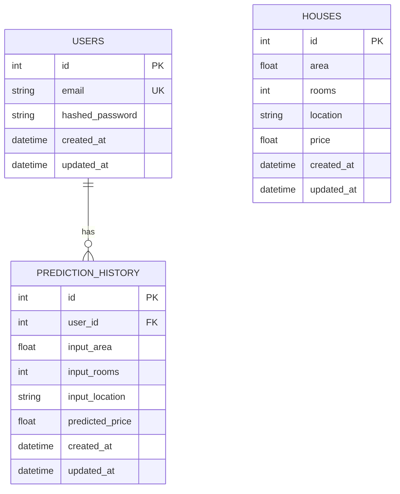

# AuditMixin And SQLAlchemy Relationships

## ERD



## Why AuditMixin Fits This Project

`AuditMixin` is plain Python multiple inheritance. It does not create its own
database table. Instead, SQLAlchemy copies the shared columns into each concrete
model that inherits from it:

```python
class User(AuditMixin, Base):
    __tablename__ = "users"
```

This keeps `id`, `created_at`, and `updated_at` consistent across tables without
making the schema more complex.

## Relationship Notes

- `relationship()` does not create a database column. It creates a Python object
  link between mapped classes.
- The real foreign key column is `PredictionHistory.user_id`.
- `back_populates` must match on both sides: `User.predictions` links to
  `PredictionHistory.user`.

## Inheritance Comparison

| Pattern | Creates parent table? | Main use case | Fit here |
| --- | --- | --- | --- |
| Mixin | No | Reuse common columns or methods | Yes, audit fields are shared by many unrelated tables |
| Single Table Inheritance | One table for all subclasses | Subtypes with mostly shared columns | No, users, houses, and predictions are separate concepts |
| Joined Table Inheritance | Parent table plus subclass tables | Subtypes sharing a real parent identity | No, audit fields do not need their own identity/table |
| Concrete Table Inheritance | Separate full tables per subclass | Rare cases needing independent subtype tables | No, it adds complexity without solving this problem |
